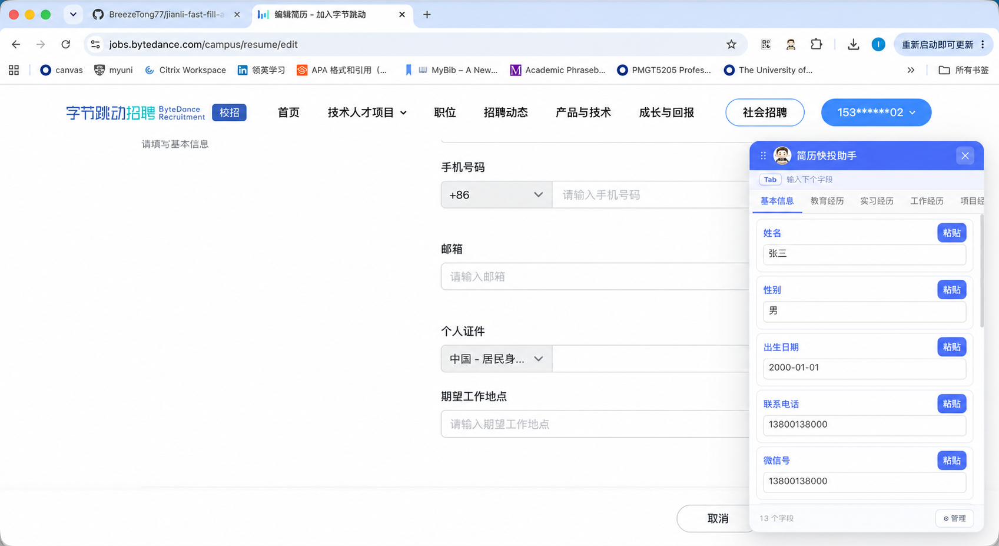

# 简历快投助手

> 面向校招与网申补录场景的本地浏览器插件。用户判断字段，工具完成写入。

## 先看演示

- [在线操作演示](https://breezetong77.github.io/jianli-fast-fill-assistant/)
- [下载插件 ZIP](https://github.com/BreezeTong77/jianli-fast-fill-assistant/archive/refs/heads/main.zip)



## 为什么做这个项目

企业网申系统的字段标准并不统一。候选人上传 PDF 简历后，仍然经常需要处理三类信息：

- **解析正确但需要复核**：姓名、手机号、邮箱等基础信息；
- **解析错漏**：项目经历、实习经历、起止时间和长文本；
- **简历中不存在**：籍贯、政治面貌、证书、亲属和期望地点等信息。

传统补录一个字段，往往要经历：

```text
切换窗口 → 查找信息 → 选中 → 复制 → 返回网申 → 定位字段 → 粘贴
```

简历快投助手把核心流程缩短为：

```text
选中目标输入框 → 点击对应字段“粘贴”
```

基于 10 个典型招聘系统的字段级 Benchmark 测算，平均每份网申约有 22.6 个字段适合快速写入，预计可减少约 4 分钟重复的信息搬运。

## 产品思路

不少自动填表工具尝试完成“识别网页字段 → 匹配简历内容 → 自动填写整张表”。但在国内校招系统中，字段命名、信息颗粒度和网页组件差异较大：

- “籍贯、户籍地、生源地”等字段语义接近，但含义不同；
- PDF 中不存在的信息无法通过 OCR 补全；
- 复杂组件识别错误后，用户仍需重新定位和修正；
- 身份证、亲属等敏感字段不适合在不可控的情况下自动写入。

因此，本项目选择一条更克制的路线：

> **人负责判断，工具负责执行。**

插件不猜测当前字段是什么，也不自动提交网申。用户明确选中目标输入框和字段内容后，插件才执行写入。

## 核心能力

| 能力 | 说明 |
|---|---|
| 结构化字段库 | 默认提供基本信息、教育、实习、工作、项目、作品、自我评价 7 类内容 |
| 完全自定义 | 分类与字段均可新增、删除、重命名和调整顺序 |
| 页面内浮动面板 | 在当前招聘页面直接查找和写入，无需反复切换窗口 |
| 一键写入 | 支持常见 `input`、`textarea` 和部分 `contenteditable` 元素 |
| Tab 连续填写 | 写入后可快速进入下一字段，减少鼠标往返 |
| 本地自动保存 | 使用 `chrome.storage.local` 保存内容，不接入外部服务 |
| 长文本提示 | 实时显示字符数，超过 500 字时给出提示 |

## 字段管理

设置页可以管理分类、字段、内容和顺序。默认模板只是起点，用户可以继续增加证书、奖项、校园经历或亲属信息。


## 快速开始

### 方式一：直接下载

1. 下载并解压[项目 ZIP](https://github.com/BreezeTong77/jianli-fast-fill-assistant/archive/refs/heads/main.zip)。
2. 打开 `chrome://extensions/`。
3. 开启右上角“开发者模式”。
4. 点击“加载已解压的扩展程序”，选择项目根目录。
5. 将插件固定在浏览器工具栏。

### 方式二：克隆仓库

```bash
git clone https://github.com/BreezeTong77/jianli-fast-fill-assistant.git
```

然后在 Chromium 浏览器的扩展管理页加载仓库根目录。

## 如何使用

1. 点击插件图标，在“管理”中维护自己的分类和字段。
2. 打开招聘网站，点击需要填写的文本输入框。
3. 在右侧浮动面板中找到对应字段，点击“粘贴”。
4. 连续补录时使用 Tab 快速进入下一字段。

## 技术实现

项目使用原生 HTML、CSS 和 JavaScript，采用 Chrome Manifest V3 扩展架构，不依赖构建工具。

```text
manifest.json
├── background/   # 工具栏点击与脚本注入
├── content/      # 浮动面板、目标输入框记录与内容写入
├── options/      # 分类和字段管理
├── demo/         # 在线演示与使用说明
└── icons/        # 扩展图标
```

写入文本后会触发 `input`、`change` 等事件，以提升与常见前端表单的兼容性。

## 数据与隐私

- 不上传 Word、PDF 或 JSON 简历；
- 不调用云端 OCR、LLM 或第三方接口；
- 字段内容默认保存在当前浏览器本地；
- 不自动提交任何招聘表单；
- 公共电脑或共享浏览器不建议保存身份证、亲属等敏感信息。

本地保存可以减少网络传输风险，但不等于加密存储。使用者仍需自行保护设备和浏览器账号。

## 当前边界

- 当前主要支持文本输入框、文本域和部分可编辑区域；
- 下拉框、级联选择、单选、多选和特殊日期组件尚未统一适配；
- 不提供 Word、JSON 或 PDF 简历解析；
- 不承诺所有招聘系统与所有前端组件均可直接写入。

## 路线图

- [ ] 支持下拉框、时间和日期组件一键填写
- [ ] 增加字段搜索、收藏和最近使用
- [ ] 适配单选、多选和级联组件
- [ ] 增加敏感字段遮罩与一键清空
- [ ] 建立更多招聘系统的回归测试用例

## 本地检查

```bash
node --check options/options.js
node --check content/content.js
node --check background/background.js
```

更完整的当前检查结果见[测试报告](./测试报告.md)。

## 参与贡献

如果你遇到无法写入的招聘网站、特殊表单组件或有新的字段管理需求，欢迎提交 Issue，并尽量附上：

- 招聘网站与页面类型；
- 浏览器版本；
- 控件类型和复现步骤；
- 脱敏后的截图或录屏。

## License

[MIT](./LICENSE)
